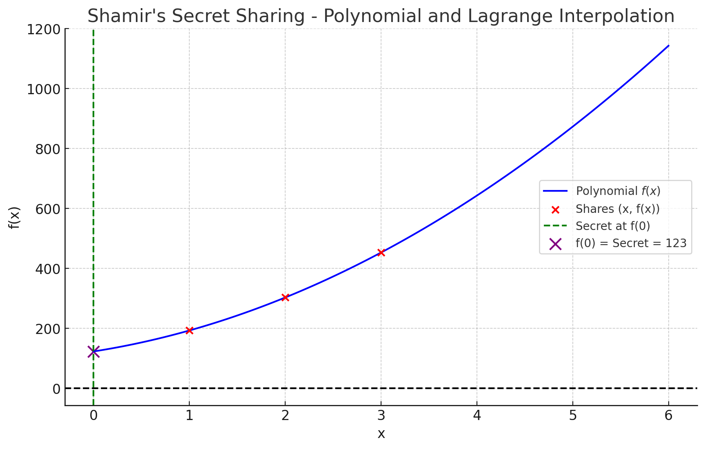

# 📘 Polynomial and Lagrange Interpolation — Foundations for Shamir’s Secret Sharing

------

## 🎯 Learning Outcomes

By the end of this, you'll understand:

1. What a polynomial is
2. What a degree of a polynomial means
3. Why polynomials are used in Shamir's Secret Sharing
4. How Lagrange Interpolation works and why it's key to reconstructing secrets
5. How it all connects in a secure, lossless cryptographic scheme

------

## 1️⃣ What is a Polynomial?

A **polynomial** is a mathematical expression involving a sum of powers of $x$ multiplied by coefficients.

### General form:

$$
f(x) = a_0 + a_1x + a_2x^2 + a_3x^3 + \dots + a_nx^n
$$

- $a_0, a_1, ..., a_n$ are constants called **coefficients**
- $x$ is the variable
- The **degree** of the polynomial is the highest power of $x$ with a non-zero coefficient

### 📌 Examples:

- $f(x) = 5x^3 + 2x + 1$ is a **3rd-degree polynomial**
- $f(x) = 7x + 4$ is a **1st-degree polynomial**
- $f(x) = 10$ is a **0th-degree polynomial** (a constant)

------

## 2️⃣ What is an n-degree Polynomial?

An **n-degree polynomial** is a polynomial where the highest exponent of $x$ is $n$.

### Why does this matter?

- You need $n + 1$ unique points to fully determine an n-degree polynomial.
- Example:
  - A **1st-degree (linear)** polynomial: needs 2 points
  - A **2nd-degree (quadratic)** polynomial: needs 3 points

------

## 3️⃣ Why Use Polynomials in Shamir's Secret Sharing?

### Problem:

You want to split a secret $s$ into parts and only allow recovery if **at least $k$** out of **$n$** parts are combined.

### Solution:

Use a **(k - 1)-degree polynomial**:
$$
f(x) = s + a_1x + a_2x^2 + \dots + a_{k-1}x^{k-1}
$$

- $s$ is the **secret** = constant term $a_0$
- $a_1, ..., a_{k-1}$ are random values
- Each **share** is a point $(x_i, f(x_i))$
- Only with **k** points can you **reconstruct** the original polynomial and extract the secret $f(0) = s$

------

## 4️⃣ What is Lagrange Interpolation?

### Goal:

Given $k$ points $(x_1, y_1), (x_2, y_2), ..., (x_k, y_k)$, find a polynomial $f(x)$ of degree ≤ $k - 1$ that passes through all points.

### The Formula:

$$
f(x) = \sum_{j=1}^{k} y_j \cdot L_j(x)
$$

Where each **Lagrange basis polynomial** $L_j(x)$ is:
$$
L_j(x) = \prod_{\substack{1 \le m \le k \\ m \ne j}} \frac{x - x_m}{x_j - x_m}
$$

------

### To Find the Secret:

Set $x = 0$, so:
$$
s = f(0) = \sum_{j=1}^{k} y_j \cdot L_j(0)
$$
Each $L_j(0)$ is computed based on the known $x$-values of shares.

------

### 💡 Step-by-Step Intuition (With 3 Shares)

Let's say you have 3 shares:

- $(1, 207)$
- $(2, 305)$
- $(3, 445)$

You know they lie on a quadratic curve:
$$
f(x) = a_0 + a_1x + a_2x^2
$$
Your goal: use Lagrange interpolation to find $f(0) = a_0 = \text{secret}$

------

### 🔢 Lagrange Interpolation Demo (Simplified)

#### Suppose:

$$
f(x) = a_0 + a_1x + a_2x^2
$$

And we know 3 points: $(x_1, y_1), (x_2, y_2), (x_3, y_3)$

We construct:
$$
L_1(0) = \frac{(0 - x_2)(0 - x_3)}{(x_1 - x_2)(x_1 - x_3)}
$$
Then:
$$
f(0) = y_1 \cdot L_1(0) + y_2 \cdot L_2(0) + y_3 \cdot L_3(0)
$$
This gives us the secret!

------

## 📊 Visual Explanation: f(0) and the Curve

- Red Dots = Shares (known points)
- Blue Curve = Polynomial $f(x)$
- Green Line at $x=0$: Marks the vertical where the secret lies
- Purple Dot = $f(0) = s$: The y-intercept (the secret)

You can reconstruct this entire blue curve using **just the red dots** (if ≥ $k$), and evaluate at $x = 0$ to find the secret.

------

## 🧠 Why is This Secure?

- A $(k - 1)$-degree polynomial is **underdetermined** with fewer than $k$ points.
- Example: With 2 points, infinitely many 2nd-degree curves could fit — no way to guess the real one.

This gives Shamir’s scheme **information-theoretic security** — even with **infinite computing power**, you cannot recover the secret without $k$ shares.

------

## ✅ Summary

| Concept                | Meaning                                                      |
| ---------------------- | ------------------------------------------------------------ |
| Polynomial             | Equation of multiple terms, each with powers of x            |
| Degree of polynomial   | Highest power of x                                           |
| Secret as constant     | In SSS, secret is the constant term $a_0$                    |
| Lagrange Interpolation | Way to reconstruct a polynomial from known points            |
| $f(0) = s$             | The secret is recovered by evaluating the polynomial at $x = 0$ |

## Shamir's Secret Sharing - Polynomial and Lagrange Interpolation

Interactive charts of this type not yet supported

### 📘 Notes: Shamir’s Secret Sharing (SSS) with Mathematical Explanation

------

## 🔐 Purpose

Shamir's Secret Sharing allows a secret $s$ to be split into $n$ parts (shares), such that:

- Any $k$ out of $n$ shares can reconstruct the secret.
- Fewer than $k$ shares provide no information about the secret.

This is known as a **$(k, n)$** threshold scheme.

------

## 🧮 Mathematical Formulation

### 1. **Polynomial Construction**

We construct a random polynomial of degree $k - 1$:
$$
f(x) = a_0 + a_1 x + a_2 x^2 + \cdots + a_{k-1} x^{k-1}
$$
Where:

- $a_0 = s$ is the secret.
- $a_1, a_2, \dots, a_{k-1}$ are random coefficients.
- All arithmetic is done over a finite field (e.g., modulo a prime).

Each share is a point:
$$
(x_i, f(x_i))
$$
for $i = 1$ to $n$, with all $x_i$ distinct and non-zero.

------

## 🔄 Reconstruction via Lagrange Interpolation

Given $k$ shares $(x_i, y_i)$, we reconstruct $f(0) = s$ using Lagrange interpolation:
$$
f(0) = \sum_{j=1}^{k} y_j \cdot \ell_j(0)
$$
Where:
$$
\ell_j(x) = \prod_{\substack{1 \le m \le k \\ m \ne j}} \frac{x - x_m}{x_j - x_m}
$$
Set $x = 0$ to extract the secret (the constant term of the polynomial).

------

## 📉 Graph Explanation

The plotted graph above shows:

- The polynomial $f(x) = 20x^2 + 50x + 123$
- Red dots: 3 shares (points on the curve)
- Purple dot: $f(0) = 123$, the original secret
- Green dashed line: $x = 0$, vertical axis
- Blue curve: Full polynomial determined from any 3 of those red dots

Even though we don’t know the full curve, **any 3 valid shares** (on the red points) allow you to reconstruct the entire blue curve, and thereby compute $f(0)$.

------

## 💡 Why Does It Work?

- A degree-$d$ polynomial is uniquely defined by $d + 1$ points.
- With $k$ shares, we can reconstruct a degree $k - 1$ polynomial.
- The secret is the constant term $f(0)$, which is obtained by evaluating the polynomial at $x = 0$.

------

## 🚫 Security Note

- With fewer than $k$ shares, the secret remains **information-theoretically secure**.
- The missing degrees of freedom make it impossible to guess the original polynomial.