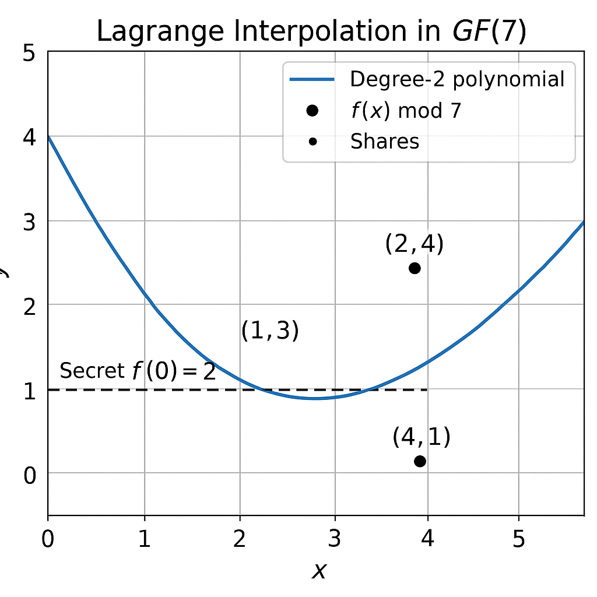
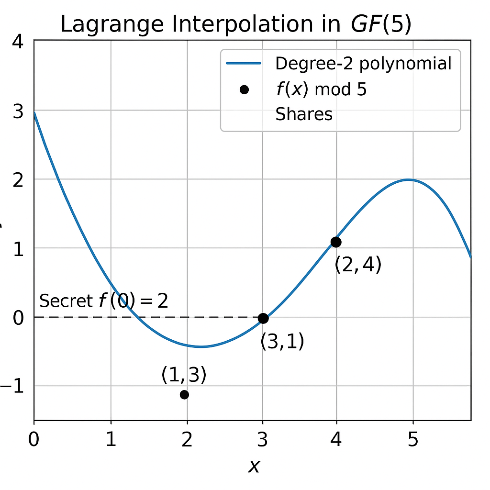

# **Learning Note: Modular Arithmetic, Finite Fields, and Shamir’s Secret Sharing**

This note explains the **mathematical foundation** behind using **mod a large prime** in cryptographic schemes like **Shamir’s Secret Sharing (SSS)**, and why **plain integer polynomials** are insecure.

------

## 1️⃣ **What Does “mod a Large Prime” Mean?**

### **Definition of Modular Arithmetic**

- **Modular arithmetic** is a system where numbers “wrap around” after reaching a certain value, called the **modulus**.

- Example with small numbers:
  $$
  10 \mod 7 = 3
  $$
  Because $10 = 7 \times 1 + 3$

### **Mod a Large Prime**

- In cryptography, the **modulus is a large prime number** $p$, often 256, 512, 1024, or 2048 bits.

- When we compute:
  $$
  x \mod p
  $$

  - The result is always between $0$ and $p-1$
  - Arithmetic **wraps around** this prime field

- **Why prime?**

  - Ensures the set $\{0, 1, 2, ..., p-1\}$ forms a **finite field GF(p)**
  - Every non-zero number has a **multiplicative inverse** (essential for Lagrange interpolation)

------

## 2️⃣ **Without Modular Reduction (Raw Integer Arithmetic)**

If we compute polynomials **without a modulus**, like:
$$
f(x) = a_0 + a_1x + a_2x^2
$$
Then:

1. **Shares grow in size** as $x$ increases
   - Example: $x^3$ grows fast for large x
2. **Interpolation in integers is possible with < k shares**
   - Standard polynomial interpolation (Lagrange) works in integers
   - Attacker can **predict missing coefficients** from partial data if secret or coefficients are small enough
3. **Information leakage**
   - High bits of shares can reveal bits of the secret
   - Example:
     - Secret = 42
     - Share at $x=1$ = 42 (leaks secret immediately!)

**Conclusion:**
 Raw integer SSS is **not information-theoretically secure**.

------

## 3️⃣ **Finite Field Arithmetic and GF(p)**

A **finite field** $GF(p)$ (Galois Field of prime order $p$) has:

1. **Elements:** $0, 1, 2, ..., p-1$
2. **Operations:**
   - Addition: $(a + b) \mod p$
   - Multiplication: $(a \times b) \mod p$
   - Inversion: $a^{-1} \mod p$ exists for all $a \neq 0$
3. **Key Property:**
   - Polynomial of degree $k-1$ is **uniquely defined by k points** in GF(p)
   - Fewer than k points → **infinitely many polynomials possible**, so **secret is information-theoretically hidden**

### **Polynomial in GF(p)**

Example Shamir polynomial:
$$
f(x) = a_0 + a_1 x + a_2 x^2 \mod p
$$

- $a_0 =$ secret
- $a_1, a_2 =$ random coefficients in $[0, p-1]$

**Share generation:**
$$
y_i = f(x_i) \mod p
$$

# **Understanding GF(p): Galois Field of Prime Order**

## **What is GF(p)?**

- **GF(p)** stands for **Galois Field with p elements**, where **p is a prime number**.
- It is a **set of numbers** where we do **addition, subtraction, multiplication, and division** **mod p**.

Think of GF(p) as:
$$
GF(p) = \{ 0, 1, 2, ..., p-1 \}
$$
All calculations **wrap around p**.

------

### **Example 1: GF(5)**

$$
GF(5) = \{ 0, 1, 2, 3, 4 \}
$$

- **Addition mod 5**
  $$
  3 + 4 = 7 \mod 5 = 2
  $$

- **Multiplication mod 5**
  $$
  2 \times 4 = 8 \mod 5 = 3
  $$

- **Subtraction mod 5**
  $$
  1 - 4 = -3 \mod 5 = 2
  $$

- **Division mod 5 (using multiplicative inverse)**

  - $2^{-1} \mod 5 = 3$ because $2 \times 3 = 6 \mod 5 = 1$
  - $4 / 2 \mod 5 = 4 \times 2^{-1} = 4 \times 3 = 12 \mod 5 = 2$

✅ **Observation**: Every non-zero number has a multiplicative inverse.

------

### **Example 2: GF(7)**

$$
GF(7) = \{ 0, 1, 2, 3, 4, 5, 6 \}
$$

- **Addition table (mod 7)**:

| +    | 0    | 1    | 2    | 3    | 4    | 5    | 6    |
| ---- | ---- | ---- | ---- | ---- | ---- | ---- | ---- |
| 0    | 0    | 1    | 2    | 3    | 4    | 5    | 6    |
| 1    | 1    | 2    | 3    | 4    | 5    | 6    | 0    |
| 2    | 2    | 3    | 4    | 5    | 6    | 0    | 1    |
| …    | …    | …    | …    | …    | …    | …    | …    |

- Notice how numbers **wrap around** after 7.

------

### ✅ **Why GF(p) is Important in Cryptography**

1. **Closure and predictability**
   - No overflow issues, numbers stay in $0..p-1$
2. **Multiplicative inverse exists for every non-zero element**
   - Makes **division** well-defined
3. **Supports polynomial arithmetic in a finite field**
   - Essential for **Shamir’s Secret Sharing** and **elliptic curve cryptography**
4. **Information-theoretic security**
   - Without enough shares, the secret can be **any value in GF(p)**

------

## **Illustrating GF(p) on a Circle**

One way to visualize GF(p) is a **modular clock**:

- **GF(5)** looks like a clock with 5 hours: 0 → 1 → 2 → 3 → 4 → 0
- **Addition moves clockwise**
- **Multiplication is like repeated jumps**

------

## **How GF(p) Is Used in Shamir’s Secret Sharing**

1. Choose a **prime p > secret**

2. Construct a **random polynomial in GF(p)**:
   $$
   f(x) = a_0 + a_1x + a_2x^2 \mod p
   $$

   - $a_0 = $ secret
   - $a_1, a_2 = $ random numbers in GF(p)

3. Generate shares as points:
   $$
   (x, f(x) \mod p)
   $$

4. Reconstruct secret using **Lagrange interpolation in GF(p)**

##### Example of GF(7)

##### Example GF(5)

------

## 4️⃣ **Why Lagrange Interpolation in GF(p) Is Secure**

### **Lagrange Interpolation Formula**

Given k shares $(x_i, y_i)$, the secret $a_0$ can be reconstructed as:
$$
f(0) = \sum_{i=1}^{k} y_i \cdot \lambda_i \mod p
$$
Where:
$$
\lambda_i = \prod_{j=1, j \neq i}^{k} \frac{x_j}{x_j - x_i} \mod p
$$

- Each fraction is **modular inverse** (exists only in prime fields)
- Requires **exactly k shares** to get the secret

------

### **Why Fewer than k Shares Reveal Nothing**

1. In GF(p), **random coefficients are uniform modulo p**
2. With $k-1$ or fewer shares:
   - Infinite number of polynomials can pass through the given points
   - Secret (the value at $x=0$) could be **any value in GF(p)**
   - Attackers gain **0 bits of information** about the secret
3. This is the essence of **Information-Theoretic Security**

------

## 5️⃣ **Polynomial Interpolation Leakage Without Mod Prime**

If you **don’t use mod p**:

1. Interpolation happens in **ℤ (integers)**:
   - Unique polynomial passes through any k points
   - Even **k-1 points can reveal partial structure**
2. Example:
   - Secret = 123
   - Polynomial: $f(x) = 123 + 45x + 67x^2$
   - Share at x=1 = 235 → already hints secret < 235
3. Attackers can:
   - Solve for coefficients with less than k shares if the space is small
   - Use **lattice attacks** for large integers

------

## 6️⃣ **Why Large Prime Size Matters in SSS**

- **Prime size ≥ secret size** ensures secret fits in field
- **Bigger primes = bigger security**
  - 256-bit → suitable for modern cryptography (AES-256 level)
  - 512/1024/2048-bit → used in academic learning or for very high entropy secrets
- **Security relies on**:
  1. Random coefficients in GF(p)
  2. Mod p arithmetic ensures **wraparound hides polynomial structure**
  3. Fewer than k shares → **completely random secret in GF(p)**

------

## What If your **secret is smaller than the key size (prime field size)** in **Shamir’s Secret Sharing (SSS)**, here is the **impact and considerations**:

------

### 1️⃣ **Security Perspective**

- **Key size (prime p)** determines the **finite field GF(p)**.
- Secret $S$ must satisfy:

$$
0 \leq S < p
$$

- If your secret is **smaller than p**, there is **no direct functional problem**, because SSS only requires the secret to be within the field.

#### ✅ Security Note:

- An **attacker sees the shares** as random points in GF(p).
- As long as **p is large enough**, the **entropy** comes from the **field size**, not just the secret length.
- If the secret is much smaller than p, **entropy is effectively lower** than the maximum provided by GF(p).

------

### 2️⃣ **Example**

- Suppose **key size = 1024 bits**
   → $p \approx 2^{1024}$
- Your secret is a **16-bit number (0–65535)**

**What happens:**

1. Polynomial is generated modulo $p$ (a 1024-bit prime).
2. Shares are huge (~1024 bits), **but actual secret entropy is only 16 bits**.
3. **Brute force possible** if the adversary guesses small secrets.

------

### 3️⃣ **Impact Summary**

| Scenario                                   | Impact                                                  |
| ------------------------------------------ | ------------------------------------------------------- |
| Secret smaller but random                  | Works, but entropy limited to secret size               |
| Secret smaller and predictable (e.g., PIN) | Easily brute-forced if k is small                       |
| Secret << p                                | Large shares, but security only as strong as the secret |

------

### 4️⃣ **Best Practices**

1. **Pad the secret** to match the key size
   - Example: Append random bytes before applying SSS.
2. **Hash the secret first**
   - Convert a small secret to a fixed-length digest (256–512 bits) to improve entropy.
3. **Choose p appropriately**
   - It must be **> secret**, but don’t unnecessarily choose extremely large p if the secret is tiny.

------

### 5️⃣ **Illustration**

- Secret: `42` (small)
- Field: $GF(2^{1024})$
- Shares: huge 1024-bit numbers
- Security:
  - Without random padding, attacker can **try all 0–65535** secrets easily.

# Wish you all success